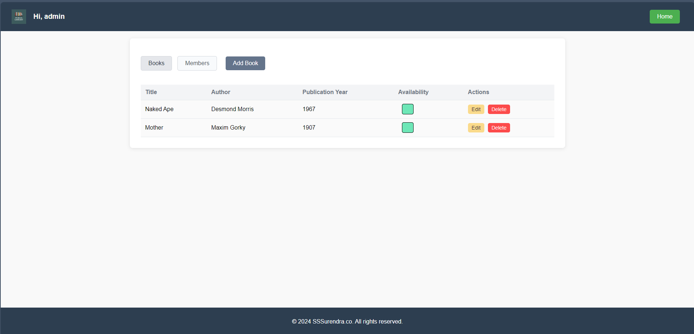
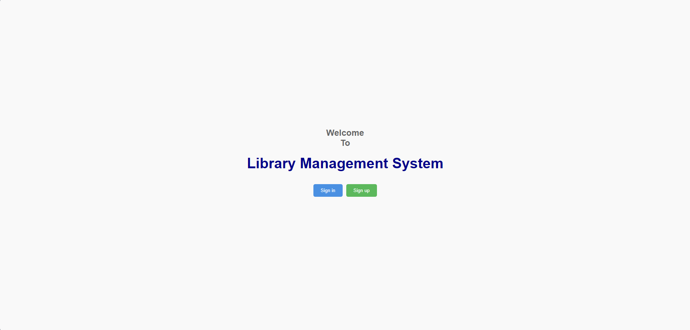

# Library Management System - FE

This is a **Library Management System** built with **ReactJS** to learn the basics of front-end development. This project is designed for anyone, especially beginners like me, who want to learn about front-end technologies by exploring the code.

**Reminder**: This is not a perfect codebase—feel free to explore, provide feedback, and share ways I can improve!

In this project, I focused on learning the **core concepts of ReactJS**, including:

- Using **TypeScript** instead of vanilla JavaScript to add type safety.
- Exploring key React features like **props**, **components**, **JSX/TSX**, **hooks**, and **state management**.
- Structuring a **ReactJS** project efficiently.
- Learning to work with **useState**, **useEffect**, **useMemo**, **useContext**, **useCallback**, and more hooks.
- Handling **redirection** in React.
- Learning **state management** using **Redux Toolkit**.

Let’s dive in!

---

## Table of Contents

- [Installation](#installation)
- [Technologies Used](#technologies-used)
- [Getting Started](#getting-started)
- [Folder Structure](#folder-structure)
- [React Learning Tips](#react-learning-tips)
- [Screenshots](#screenshots)
- [Resources](#resources)
- [Comments and Feedback](#comments-and-feedback)
- [Contribution](#contribution)

---

## Installation

### Prerequisites

Before you start, make sure you have the following installed:

- Basic knowledge of **Vanilla JavaScript**.
- **Node.js** (v22 or higher).
- **npm** (v10.9.0 or higher).
- Familiarity with **TypeScript**: [The TypeScript Handbook](https://www.typescriptlang.org/docs/handbook/intro.html).

### Steps to Install

1. **Clone the repository**:

   ```bash
   git clone <repository-url>
   ```

2. **Install the dependencies**:

    ```bash
    npm install
    ```

3. **Run the project locally**:

    ```bash
    npm run dev
    ```

Your app should now be running on your local server!

---

## Technologies Used

- **ReactJS** with **TypeScript** (main codebase).
- **CSS** for styling.
- **Axios** for HTTP requests.
- **JWT Authentication** (Please note, the implementation isn’t perfect, but I'm open to suggestions).
- **React Router DOM** for routing between pages.
- **React Hook Form** for handling forms: [React Hook Form](https://www.react-hook-form.com/).

---

## Getting Started

Here’s the journey I took to learn these technologies and build this project:

- **Started with HTML**:
    - What **markup** means.
    - Learning **HTML tags** and their structure.
    - Understanding **semantics** and why they matter for accessibility and SEO.
    - Worked with forms, tables, and inputs.

- **Moved on to CSS**:
    - How to style elements and create responsive designs.

- **Explored Vanilla JavaScript**:
    - Learned the **DOM** and how it works to interact with the webpage.
    - Reviewed this great article to understand the **JavaScript fundamentals**: [JavaScript Questions by Lydia Hallie](https://github.com/lydiahallie/javascript-questions).
    - Worked with **callbacks**, **promises**, and **async/await** to manage asynchronous code.

- **Dove into ReactJS**:
    - **This was the moment of revelation!**
    - ReactJS is all about **reusability**. Each component can be reused with different data, which is super powerful.
    - Learned about **React component lifecycle**, **Virtual DOM**, and how React optimizes updates.
    - Curious about how things work **behind the scenes** in React, but still figuring it out.

---

## Folder Structure

In **ReactJS**, you have the flexibility to organize your files however you want, but this is how I structured my project. It can feel a bit chaotic at first, especially if you're used to backend technologies, but trust me, you’ll appreciate the flexibility over time.

- Oh boy, this part was a pain in the a$$.

```markdown
src
  ├── app
  ├── assets
  │   ├── images
  │   └── fonts
  ├── components
  │   ├── nav-bar
  │   │   ├── NavBar.tsx
  │   │   └── NavBar.less
  │   ├── book-card
  │   │   ├── BookCard.tsx
  │   │   └── BookCard.less
  ├── context
  ├── e2e
  ├── pages
  │   ├── books
  │   │   ├── BookListPage.tsx
  │   │   └── AddBookPage.tsx
  ├── layouts
  │   ├── app-layout
  │   └── public-layout
  ├── locales
  │   ├── de
  │   │   └── translation.json
  │   └── en
  │       └── translation.json
  ├── models
  │   ├── book.ts
  │   └── author.ts
  ├── routes
  │   └── Routes.tsx
  ├── services
  │   └── bookService.ts
  ├── styles
  │   └── styles.less
  └── utils
      ├── constants.ts
      └── dateUtils.ts
```

---

## React Learning Tips

Here are some tips and resources that helped me as a beginner:

- **Understand the concept of a stateful variable** first, then learn how to use the `useState` hook in React.
- Once you're comfortable with `useState`, dive into the **other hooks** (`useEffect`, `useContext`, `useMemo`, `useCallback`, etc.) to manage side effects, contexts, and performance.
- **Use TypeScript** to ensure better code quality and avoid common mistakes: [React + TypeScript tutorial](https://www.youtube.com/watch?v=TPACABQTHvM).
- Combine **text-based learning** with **visuals** like videos and diagrams to better understand abstract concepts.
- Don’t hesitate to **ask for code reviews** from others! Stay humble and learn from feedback.
- **Practice makes perfect**. It’s easy to read tutorials, but coding it yourself is where you’ll really learn.

---

## Screenshots

Here are some screenshots of the project in action:




---

## Resources

Here are some resources I found helpful while learning:

- **[Lydia Hallie's Articles](https://dev.to/lydiahallie)** (Great for beginners and intermediate learners!)
- **[Coseden Solutions YouTube Channel](https://www.youtube.com/@cosdensolutions)** (Helpful videos on React and TypeScript)
- **[MDN Web Docs](https://developer.mozilla.org/en-US/docs/Learn_web_development)** (Comprehensive web development tutorials)
- **[The TypeScript Handbook](https://www.typescriptlang.org/docs/handbook/intro.html)**
- **[React Dev Docs](https://react.dev/learn)** (Official React documentation)

---

## Comments and Feedback

I’d love to hear how I can improve this project! 💖 Whether it’s code quality, project structure, or new features, feel free to leave your feedback.

---

Happy coding!